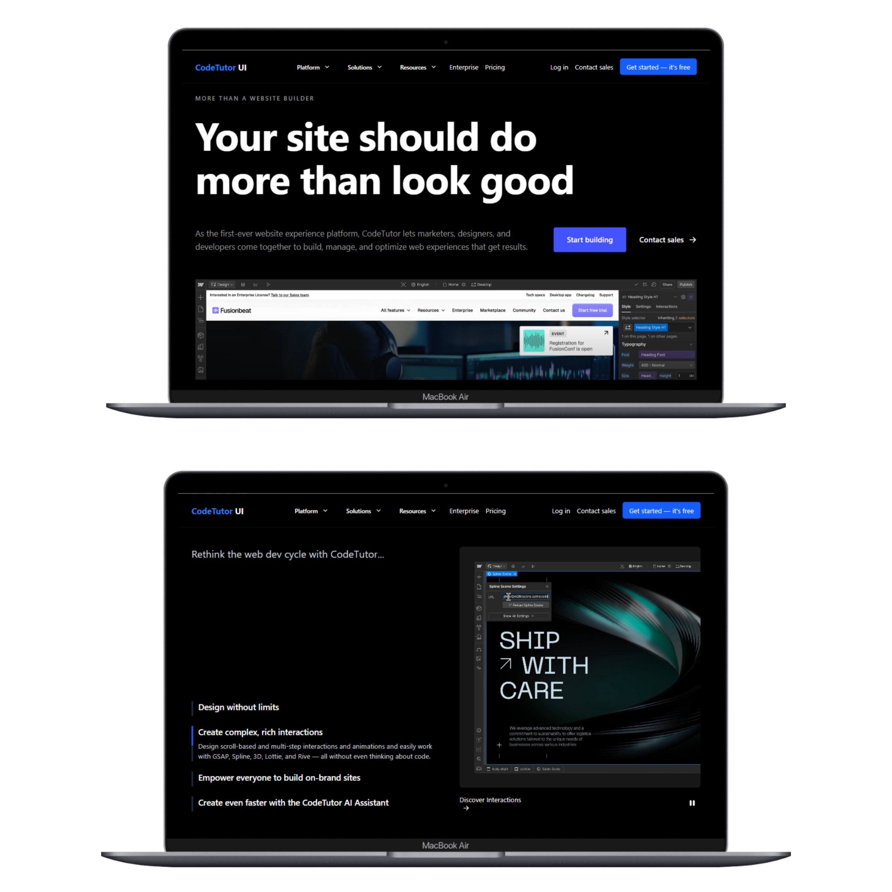

# 🚀 Landing Page - React + TypeScript + Tailwind CSS

This project is a **modern single-page landing website** built with **React**, **TypeScript**, and **Tailwind CSS**. It features **smooth animations**, clean design, and navigation powered by **React Router**.

---

## Live Demo
You can check out the live demo of the project at the following link : [LandingTypeScript](https://react-landing-ts-mxne.vercel.app/)

---

## ✨ Features

- ⚛️ Built with **React 19** and **TypeScript**
- 🎨 Modern UI styled with **Tailwind CSS**
- 🧭 Client-side routing with **React Router**
- 📱 Fully **responsive design** (mobile, tablet, desktop)
- 🧼 Clean and scalable code structure
- ⚡ High performance and optimized loading

---

## 🛠️ Tech Stack

- **React**
- **TypeScript**
- **Tailwind CSS**
- **React Router DOM**

---

## 🚀 Getting Started

### Prerequisites

- Node.js (v16 or higher recommended)
- npm or yarn

### Installation

```bash
# Clone the repository
git clone https://github.com/hamedhmd88/react-landing-ts.git

# Navigate into the project directory
cd your-repo-name

# Install dependencies
npm install
# or
yarn install

```


## 📸 Sample Screenshot

Below is a sample screenshot of the project:




